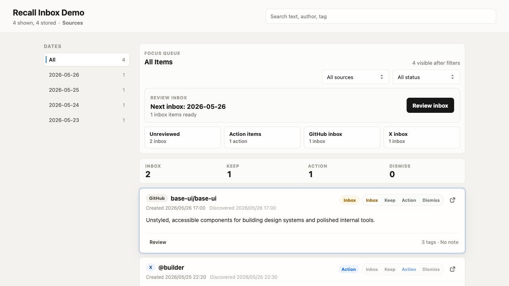

# Recall Inbox

A self-hosted inbox for X bookmarks, GitHub stars, and other saved items. Recall
Inbox turns scattered saves into a reviewable workflow: sync -> review -> tag/note -> export.



## Why

Bookmarks and stars are easy to collect and hard to revisit. Recall Inbox gives
them a lightweight processing queue with review states, tags, notes, daily sync,
and Markdown export, while keeping the data in infrastructure you control.

## Who It Is For

- People who save useful posts and repositories but rarely process them later.
- Developers who want GitHub Stars and X bookmarks in one searchable review UI.
- Personal knowledge management users who prefer local Markdown and self-hosted
  data over another hosted read-it-later service.

## One-Minute Demo

Try the review UI without creating API tokens:

```bash
yarn install
yarn demo
yarn view
```

Open `http://127.0.0.1:17864`. `yarn demo` only seeds sample data when the local
store is empty. Use `yarn demo -- --force` to replace existing local sample data.

## Features

- Sync X bookmarks through OAuth 2.0.
- Sync GitHub starred repositories with a personal access token.
- Review saved items with `inbox / keep / action / dismiss`, tags, and notes.
- Export Markdown files to `outputs/daily/YYYY-MM-DD.md`.
- Deploy the same review UI and sync job to Cloudflare Workers with D1, or to
  Vercel with Postgres.

## Deployment Options

- Local only: use `.data/items.json`, `yarn sync:x`, `yarn sync:github`, and
  `yarn view`.
- Cloudflare: deploy the review UI, API, D1 database, and scheduled sync with
  `yarn cf:release`.
- Vercel: deploy the same UI and API routes with Postgres and Vercel Cron.

## Project Direction

See [Roadmap](ROADMAP.md) for planned source adapters, review workflow
improvements, action exports, GitHub Stars intelligence, and deployment
polish.

## Source Configuration

Configure one or more sources.

- X bookmarks require `X_CLIENT_ID` and `X_CLIENT_SECRET`.
- GitHub stars require `GITHUB_TOKEN`.

X callback URLs depend on where you run authorization:

- Local CLI: `http://127.0.0.1:17863/callback`
- Cloudflare Worker: `https://<your-worker-url>/api/auth/x/callback`
- Vercel: `https://<your-vercel-domain>/api/auth/x/callback`

## Local Setup

Install dependencies:

```bash
yarn install
```

Copy the environment template:

```bash
cp .env.example .env
```

Fill in the source credentials you need. For local X authorization, use the
local callback URL in both the X Developer Portal and `.env`:

```text
http://127.0.0.1:17863/callback
```

Build:

```bash
yarn build
```

Authorize X only if you use the local X source:

```bash
yarn auth:x
```

Run the sync command for each source you configured:

```bash
yarn sync:x
yarn sync:github
```

`sync` is X-only and requires `yarn auth:x` first. `sync:github` is
GitHub-only and requires `GITHUB_TOKEN`. A fine-grained GitHub token with access
to starred repositories is enough for personal use.

Review stored items locally:

```bash
yarn view
```

Open `http://127.0.0.1:17864`.

Regenerate Markdown from already stored local data without calling remote APIs:

```bash
yarn export:md
```

## Data Rules

Local data is stored under `.data/`. Markdown files are written to
`outputs/daily/YYYY-MM-DD.md`.

Daily Markdown files are grouped by item creation date:

- X bookmarks use the original post `created_at` when available.
- GitHub stars use `starred_at`.
- `discoveredAt` records when the item was first seen by this app.

## Sync Limits

The local CLI sync can walk available pages until already-known items are found.
The Cloudflare Worker uses `SYNC_MAX_PAGES_PER_SOURCE` to avoid Worker request
limits. The default is `2`.

First large sync: use `First sync` in the deployed Admin dialog. It performs a
deeper full scan and does not stop just because the newest page is already in
the database. Daily scheduled syncs keep `SYNC_MAX_PAGES_PER_SOURCE`
conservative and stop once a fully known page is reached.

## Cloudflare Deployment

Run the setup script:

```bash
yarn install
yarn cf:setup
```

The script copies `wrangler.example.toml` to `wrangler.toml` when needed,
creates the `inbox` and `inbox-preview` D1 databases, and writes their ids back
to `wrangler.toml`.

If you are starting over from an existing `wrangler.toml`, run:

```bash
yarn cf:setup -- --force
```

If you are not logged in to Cloudflare yet, run this first:

```bash
yarn wrangler login
```

Set `ADMIN_SECRET`, plus the source secrets you use:

```bash
yarn wrangler secret put ADMIN_SECRET
yarn wrangler secret put X_CLIENT_ID
yarn wrangler secret put X_CLIENT_SECRET
yarn wrangler secret put GITHUB_TOKEN
```

`ADMIN_SECRET` protects operator-only endpoints such as manual sync and one-time
X authorization. `X_CLIENT_ID` and `X_CLIENT_SECRET` are only needed for X
bookmarks. `GITHUB_TOKEN` is only needed for GitHub stars. Scheduled cron runs
do not need an authorization header.

Build, migrate, and deploy:

```bash
yarn cf:release
```

Manual setup is also possible:

```bash
cp wrangler.example.toml wrangler.toml
yarn wrangler d1 create inbox
yarn cf:migrate
yarn cf:deploy
```

If you use X on Cloudflare, set the X Developer Portal callback URL to:

```text
https://<your-worker-url>/api/auth/x/callback
```

Then open the deployed review page, click `Admin`, enter `ADMIN_SECRET`, and
use `Authorize X`. The page starts the protected one-time OAuth flow without
putting the secret in the authorization URL. The Worker stores the resulting X
token in D1 and refreshes it during later syncs.

The default cron is `15 18 * * *`, which runs at 18:15 UTC. Adjust
`wrangler.toml` if you want another time.

Run a manual sync:

```bash
curl -X POST https://<your-worker-url>/api/sync \
  -H "Authorization: Bearer <ADMIN_SECRET>"
```

The deployed review page also has protected admin controls for:

- `Authorize X`: start the one-time X OAuth flow.
- `Sync all`: sync all configured sources with the normal page limit.
- `Sync X` / `Sync GitHub`: sync one source.
- `First sync`: sync all configured sources with a deeper full-scan page limit.

The same behavior is available through query parameters:

```bash
curl -X POST "https://<your-worker-url>/api/sync?source=github&maxPages=50&fullScan=true" \
  -H "Authorization: Bearer <ADMIN_SECRET>"
```

`source` can be `all`, `x`, or `github`. `maxPages` controls how many pages each
source may fetch for that run. `fullScan=true` is useful for backfilling older
items when the newest page has already been synced.

## Vercel Deployment

Vercel uses the same Vite review UI and `/api/*` endpoints, backed by Postgres
instead of Cloudflare D1.

Create a Postgres database through Vercel, Neon, Supabase, or another hosted
provider, then set these environment variables in Vercel:

```text
POSTGRES_URL=<postgres connection string>
ADMIN_SECRET=<admin password for protected UI actions>
GITHUB_TOKEN=<optional GitHub token>
X_CLIENT_ID=<optional X app client id>
X_CLIENT_SECRET=<optional X app client secret>
SYNC_MAX_PAGES_PER_SOURCE=2
```

If you use X on Vercel, set the X Developer Portal callback URL to:

```text
https://<your-vercel-domain>/api/auth/x/callback
```

Use `migrations/0001_initial.sql` as the schema source for the Postgres
database. The table and index names are intentionally shared with D1 so the app
logic can run against either store.

The Vercel build command is:

```bash
yarn vercel:build
```

The included `vercel.json` publishes `dist/view` and schedules daily sync via:

```text
/api/cron/sync
```

Manual sync uses the same API shape as Cloudflare:

```bash
curl -X POST "https://<your-vercel-domain>/api/sync?source=github&maxPages=50&fullScan=true" \
  -H "Authorization: Bearer <ADMIN_SECRET>"
```

## Open Source Checklist

- Keep `.env`, `.data/`, `outputs/`, and `wrangler.toml` private.
- Publish `wrangler.example.toml`, not your real Wrangler config.
- Use [Source Adapter Guide](docs/source-adapter.md) when adding more saved-item
  sources.
- Rotate `X_CLIENT_SECRET`, `GITHUB_TOKEN`, and `ADMIN_SECRET` if they are ever
  exposed.
- The project is licensed under MIT. Keep `LICENSE` in published copies.

## Optional AI Summary

Set `SUMMARY_API_KEY` in `.env` to enable daily summary and action item
generation. `SUMMARY_MODEL` and `SUMMARY_BASE_URL` configure the model and
provider-compatible endpoint. If the key is absent, sync still writes the raw
Markdown list.
